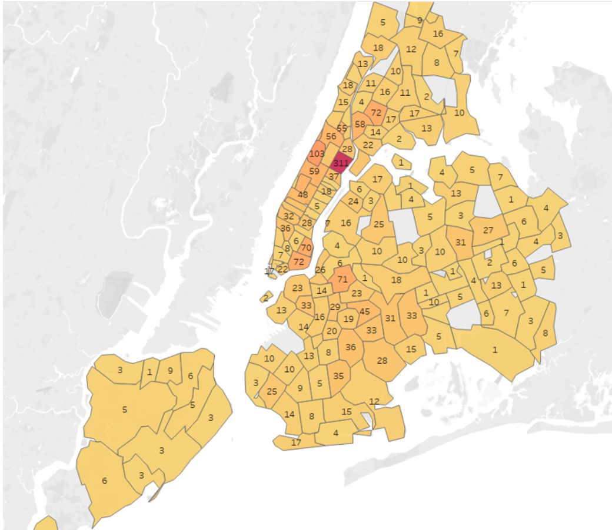
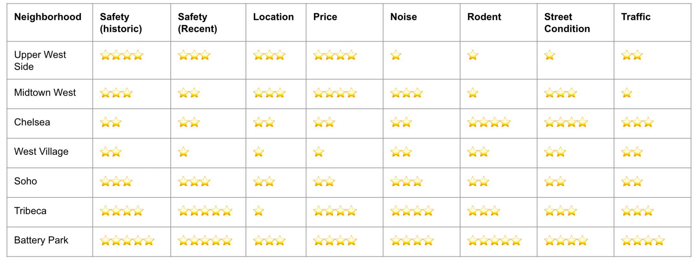

# The Most Livable Areas in New York City

People living in or planning to move into New York City have different standards when considering a place to stay. In many cases, people prefer to live further from their work/school due to their concerns for safety, availability of social services, and financial issues. In this project, we used the crime data, service call data, and housing data collected from the city government of New York and Airbnb to analyze and rank the most livable areas in 5 boroughs — Bronx, Brooklyn, Manhattan, Queens, and Staten Island — of New York City.

## Team Members

Taehyo Kim (tk2737@nyu.edu) 
Soowhan Park (sp6682@nyu.edu) 
Kyu Doun Sim (ks6401@nyu.edu) 
Mengting Yan (my2400@nyu.edu) 

## Data Sources

#### [NYPD Historical Crime Complaint Data](https://data.cityofnewyork.us/Public-Safety/NYPD-Complaint-Data-Historic/qgea-i56i)

The dataset includes all valid felony, misdemeanor, and violation crimes reported to the NYPD from 2006 to the end of 2019. The dataset is 2.243GB, containing 7.38M rows and 35 columns. Fig.1 shows a snippet of this dataset.

<figure>

</figure>

#### [NYPD Historical Arrest Data](https://data.cityofnewyork.us/Public-Safety/NYPD-Arrests-Data-Historic-/8h9b-rp9u)
The dataset includes every arrest in NYC from 2006 to 2021. Each record represents the arrests in NYC by the NYPD that includes information about the type of crime, the location, and the arrest date. The dataset is 1.13GB, containing 5.15M rows and 19 columns. Fig.2 shows a snippet of this dataset.

<figure>

</figure>

#### [Airbnb Listings Dataset](https://data.cityofnewyork.us/Social-Services/311-Service-Requests-from-2010-to-Present/erm2-nwe9)
The dataset includes Airbnb listings from 2010 to 2021.The dataset is 1.8GB, containing 500K rows and 89 columns. 

<figure>

</figure>

#### [311 Social Service Request Dataset]()

The 311 Social service request data is a dataset that has been updating in real time and has all the requests back from 2010. The dataset was about 15GB and originally contains 41 columns and 28.4M rows. It aggregates all requests from people requesting service from road conditions to any problems with the landlord or any request to the DOF(Department of Finance). With such dataset that contains diverse information we were able to appropriately extract information that relates to the livability of the area. Fig.4 shows a sample view of the processed dataset. Notice there are 7 columns instead of 41 because the dataset was reduced to only contain relevant information such as the complaint type and incident ZIP etc.

<figure>

</figure>

## Design Diagram

<figure>

</figure>

## Reverse Geocoding
We used the NYPD Crime Complaints and Arrest datasets to investigate the safety condition of neighborhoods in NYC, but the datasets only contained geographic coordinates (latitude, longitude), lacking the human-readable address information. Therefore, we had to convert the geographical coordinates into zip codes. We found a couple of tools, such as Google Geocoding API  and GeoPy Python Library that have reverse geocoding functionality, but none of them is entirely freely available in Java. Therefore, we collected geographic coordinates of all the zip codes in NYC from US Census data. For each complaint and arrest data record, we computed the Euclidean distance between its geographic coordinates and the one in the US Census dataset and found the zip code with the closest geographic distance. With Map Reduce, we managed to do it efficiently.

## Evaluation Metrics
Initially, we used crime rate to evaluate the area’s safety. However, we realized that the living population of the area might not fully represent the population density, especially when offices and big companies surround the area. Thus, we changed our evaluation metric to absolute count to match better with our expected outcomes.

## Comparison across Datasets
Comparing results across multiple high-dimensional datasets is a challenging problem. Traditionally, multiview canonical correlation analysis is used to find correlation between multiple datasets. Rather than relying on numerical analyses, we decided to utilize the commonality present in the analyses of our datasets - we mapped the evaluation metrics on to the New York map, divided by zipcodes, and performed side by side comparison.

## Finding the Appropriate Delimiter to Process Data

Finding the appropriate delimiter for the 311 dataset was a challenge there were sentences manually written by the operators under the column ”Description” that would contain multiple commas, which was the delimiter of the dataset. Therefore selecting the comma as the delimiter would give back multiple possible tokens. For example, one tokenization of a record even gave back 78 tokens, because the description included a long sequence of commas. Tokenization was utilized such that records only that were completed were to be filtered. However, the ”Status” attribute was placed later in the record, so the position of the ”Status” column were either 17, 18, or 19 or even further away. To avoid this, we checked the presence of second and third tokens, the opened date and closed date, and confirmed the validity of the dates by checking that the dates matched the definition of the ”Status” attribute. Finally, the dataset was filtered by those records.

## Results

Map of Complaints in NYC
<figure>

</figure>

Map of Arrests in NYC
<figure>

</figure>

Map of Airbnb Prices in NYC
<figure>

</figure>

Map of Location Rating in NYC
<figure>

</figure>

Map of Noise Requests in NYC
<figure>

</figure>

Map of Rodent Requests in NYC
<figure>

</figure>

Map of Street Condition Requests in NYC
<figure>

</figure>

Map of Traffic Requests in NYC
<figure>

</figure>

Ratings of Each Neighborhood in Manhattan
<figure>

</figure>

<figure>

</figure>

The final report can be found [here](final-report/Final_report.pdf).